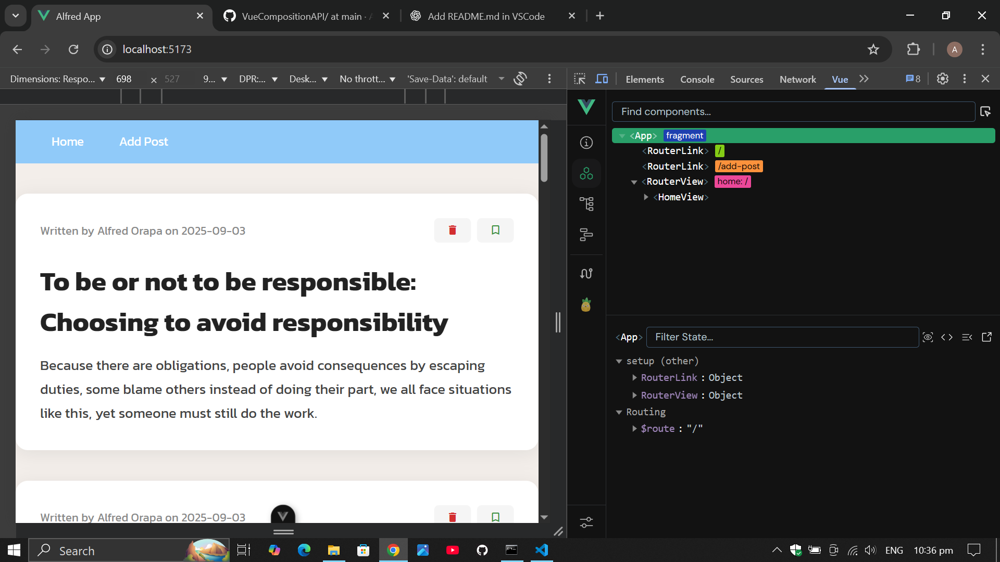
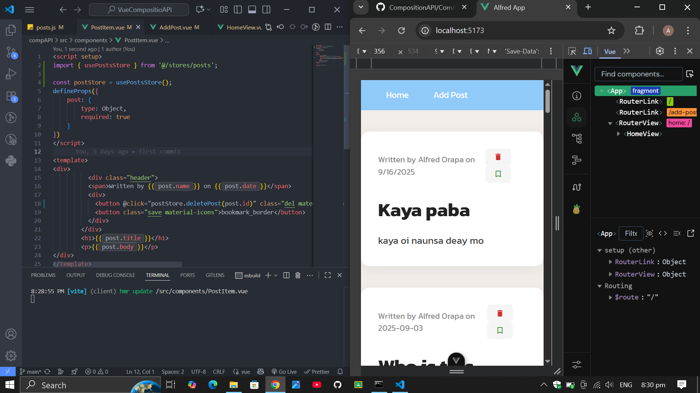
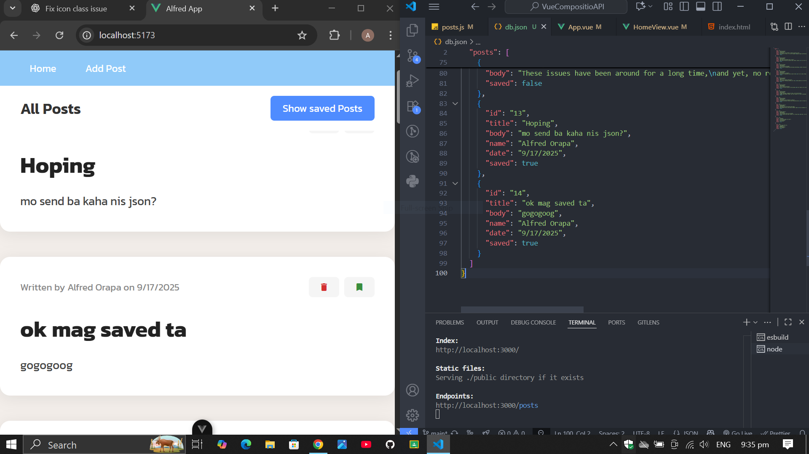

# CompositionAPI Blog Demo

A simple Vue 3 project demonstrating the use of the Composition API to display a list of blog posts with basic styling.

## Features

- Vue 3 with `<script setup>` and Composition API
- Static list of posts with author, date, title, and body
- Styled with SCSS (Sass) and Google Fonts
- Material Icons for action buttons

## Project Structure

```
src/
  assets/
    main.css         # Global styles and font import
  stores/
    (Pinia stores)   # State management files for Pinia
  views/
    HomeView.vue     # Main blog post view with SCSS styling
db.json              # JSON Server database file
```

## Setup

1. **Install dependencies**

   ```
   npm install
   ```

2. **Install Sass (if not already installed)**

   ```
   npm install -D sass
   ```

3. **Run the development server**

   ```
   npm run dev
   ```

4. **Install JSON-SERVER

   ```
   npm install -g json-server
   ```

5. **Open your browser**

   Visit [http://localhost:5173](http://localhost:5173) (or the port shown in your terminal).

## Styling

- Uses the [Kanit](https://fonts.google.com/specimen/Kanit) font from Google Fonts.
- Custom SCSS for the blog post cards and layout.
- Material Icons for delete and bookmark buttons.

## Customization

- To add or edit posts, modify the `posts` array in `src/views/HomeView.vue`.
- To change global styles, edit `src/assets/main.css`.
- To update component styles, edit the `<style lang="scss" scoped>` block in `HomeView.vue`.

## Output Every Activity

This project is for educational purposes/demonstrtion.

### Activity 4 sample Image 


### Activity 5 sample Image 


### Activity 6 sample Image



### Activity 7 sample Image



### Activity 8 sample Image



### Summary of this Activity

This project is a simple Vue 3 blog application that demonstrates the use of the Composition API along with JSON Server for backend data management. Users can add new blog posts, delete existing ones, and save (bookmark) their favorite posts. The application also features filtering functionality to easily find specific posts and arranges all posts in ascending order by date or another chosen field. With a clean interface styled using SCSS and Google Fonts, this project provides a practical example of building a modern, interactive blog with Vue 3 and a mock REST API.